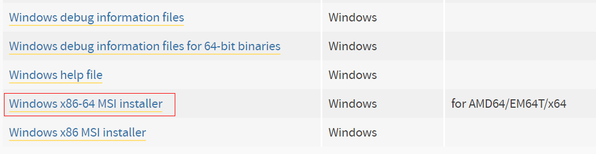
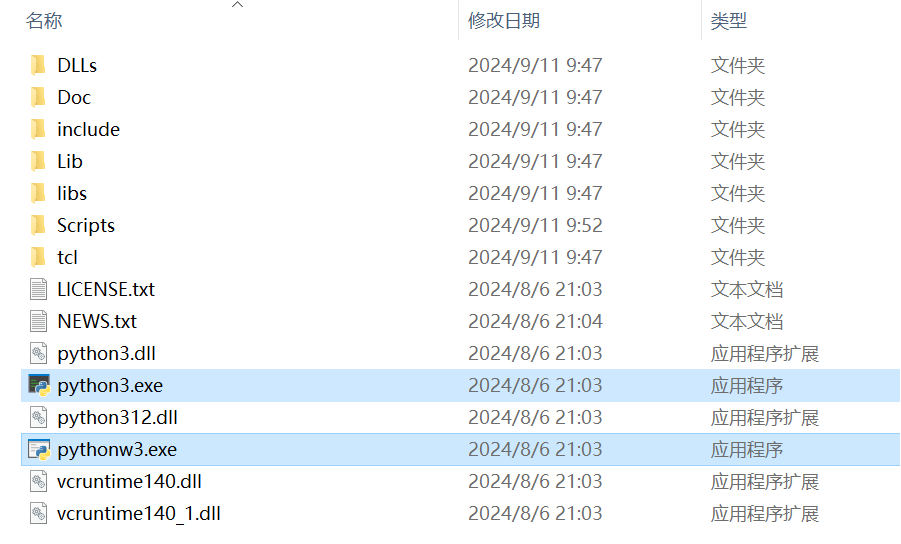
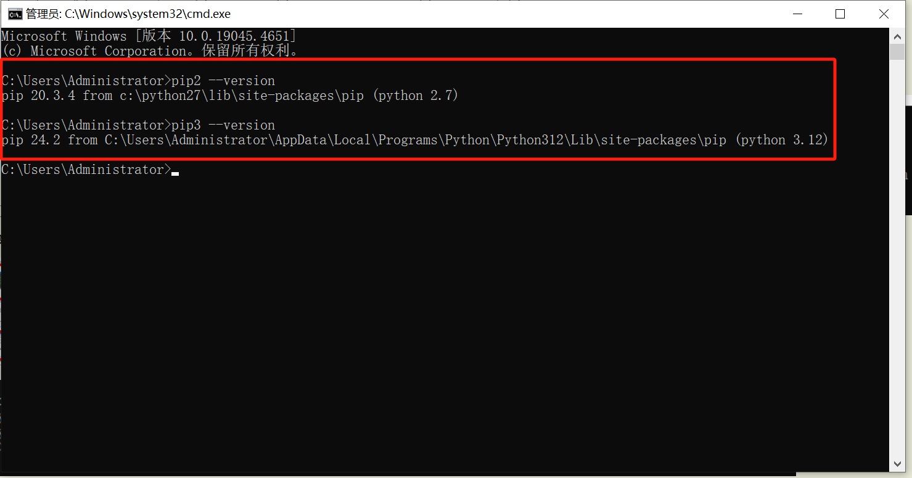

# 同时安装python2和python3

<VPAuthor :members="[
    { avatar: 'https://img-nj.piesat.cn/static/Frontend/avatar/wl.png', name: '王磊' }
  ]"
/>

## 在 Windows 和 macOS 上同时安装 Python2 和 Python3

虽然Python3已经出了，而且Python2也停止维护了，但某些项目，比如几年前的前端脚手架项目中使用node-sass就依赖Python 2，所以维护老项目的时候电脑必须得安装Python2。在学习Python的时候又需要新版本，所有就介绍一下如何在 Windows 和 macOS 系统中实现 Python 2 和 Python 3 的同时安装。

## 一、在 Windows 上安装 Python2 和 Python3

1.  **下载 Python2 和 Python3 安装包**

    - 前往 [Python 官方下载页面](https://www.python.org/downloads/windows/) 下载对应的版本。选择合适的 Python2 和 Python3 安装包。
      

    - 安装时基本都是无脑next，最好把Python2 和 Python3装在一起，方便后面找路径配置环境变量。
    - 安装完之后分别进入Python2 和 Python3的安装目录，修改名称方便cmd内识别

      - 将Python2目录下的python.exe和pythonw.exe修改成`python2.exe和pythonw2.exe`

        

      - 将Python3目录下的python.exe和pythonw.exe修改成`python3.exe和pythonw3.exe`

        

2.  **设置环境变量**

    - 打开系统的 "环境变量" 设置，找到 "Path" 变量。
    - 将 Python2 和 Python3 的路径分别添加到 "Path" 中。例如：
      ```plaintext
      C:\Python27\;C:\Python27\Scripts;C:\Python312\;C:\Python312\Scripts;
      ```
      

:::tip
配置的路径需要根据电脑实际的安装路径来的，以上的路径只是示例。
:::

3.  **验证安装**

    - 打开命令提示符 (cmd)，输入以下命令来验证 Python 2 和 Python 3 是否安装成功：
      ```bash
      python2 --version
      python3 --version
      ```

    

4.  **如果用到pip的话需要分别pip2和pip3**

    - 使用 `pip` 安装 Python 包时，可以分别为不同版本的 Python 设置对应的 `pip`：

      ```bash
      pip2:
      python2 -m pip install --upgrade pip --force-reinstall

      pip3:
      python3 -m pip install --upgrade pip --force-reinstall
      ```

    - 打开命令提示符 (cmd)，输入以下命令来验证 Python 2 和 Python 3 是否安装成功：

      ```bash
      pip2 --version
      pip3 --version
      ```

      

## 二、在 macOS 上安装 Python 2 和 Python 3

1. **使用 Homebrew 安装 Python**

   - 首先，确保你的 macOS 上已经安装了 Homebrew。如果没有安装，可以使用以下命令进行安装：
     ```bash
     /bin/bash -c "$(curl -fsSL https://raw.githubusercontent.com/Homebrew/install/HEAD/install.sh)"
     ```
   - 安装完成后，更新 Homebrew：
     ```bash
     brew update
     ```

2. **安装 Python 2 和 Python 3**

   - 使用以下命令安装 Python 2 和 Python 3：
     ```bash
     brew install python@2
     brew install python
     ```

3. **配置别名**

   - macOS 默认的 Python 版本可能已经是 Python 2。为了更方便地切换 Python 版本，你可以通过 `alias` 命令为 Python 2 和 Python 3 设置别名。
   - 编辑 `.bash_profile` 或 `.zshrc` 文件（具体文件取决于你的终端使用的是 Bash 还是 Zsh），并添加以下行：
     ```bash
     alias python2="/usr/local/bin/python2"
     alias python3="/usr/local/bin/python3"
     ```

4. **验证安装**

   - 使用以下命令检查安装是否成功：
     ```bash
     python2 --version
     python3 --version
     ```

5. **管理包的安装**

   - 同样，使用 `pip` 来管理包：
     ```bash
     pip2 install <package_name>
     pip3 install <package_name>
     ```

## 三、Python 版本管理工具

如果你需要在多个项目中频繁切换 Python 版本，可以考虑使用 `pyenv` 或 `conda` 等工具来管理 Python 版本。

1. **安装 `pyenv`**

   ```bash
   brew install pyenv
   ```

2. **使用 `pyenv` 安装不同版本的 Python**

   ```bash
   pyenv install 2.7.18
   pyenv install 3.9.7
   ```

3. **设置全局或局部 Python 版本**
   ```bash
   pyenv global 3.9.7
   pyenv local 2.7.18
   ```

---

通过以上步骤，您就可以在 Windows 和 macOS 上轻松实现 Python 2 和 Python 3 的共存，并且能够方便地在不同项目中切换 Python 版本。
